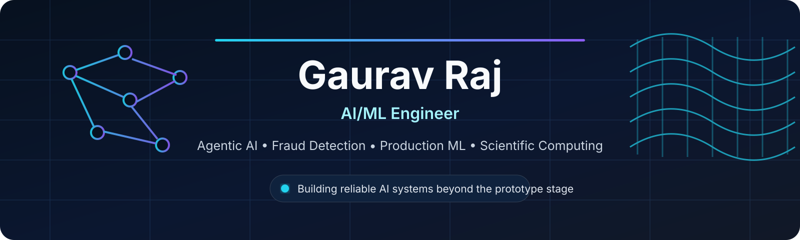

 

### Building reliable agentic systems, fraud-detection pipelines, and production ML infrastructure

---

## About

I am an **AI/ML engineer and IIT Roorkee graduate** focused on building systems that work beyond the prototype stage. My work combines applied machine learning, agentic workflows, backend engineering, and reproducible scientific software.

At **DigiDoe**, I work on AML and fraud-detection systems for a London banking platform, including anomaly detection, explainable transaction scoring, PostgreSQL-backed persistence, and event-driven processing. During my research internship at **NIMS Japan**, I helped develop **VibeTube**, an open-source pipeline for automated carbon-nanotube chirality analysis from TEM images and became a formally designated **co-first author** on the resulting publication in *Science and Technology of Advanced Materials*.

<table>
<tr>
<td width="33%" valign="top">

### Production AI
Transaction monitoring, anomaly detection, client-specific calibration, explainable decisions, and reliable data pipelines.

</td>
<td width="33%" valign="top">

### Agentic Systems
LangGraph workflows with memory, tool use, API integrations, and human approval boundaries.

</td>
<td width="33%" valign="top">

### Scientific Software
Deterministic image-analysis pipelines combining FFT processing, feature extraction, and domain-specific classification.

</td>
</tr>
</table>

---

## Experience

### Software Engineer · DigiDoe
**Independent Contractor · Remote, London · Feb 2026 – Present**

- Building an ML-driven AML and fraud-detection system that classifies suspicious transactions across multiple fraud types, paired with rule-based explainability.
- Developed unsupervised anomaly detection using clustering and statistical scoring on production transaction data, including per-client threshold calibration.
- Built PostgreSQL persistence with schema migrations for transactions, decisions, alerts, KYC profiles, model versions, and message processing.
- Implemented event-driven transaction processing with session ordering, retries, deduplication, and dead-letter handling.
- Containerized and validated the service end to end with Docker.

### Machine Learning Intern · National Institute for Materials Science, Japan
**Tsukuba, Japan · May 2025 – Aug 2025**

- Built an end-to-end pipeline for automated carbon-nanotube chirality analysis from TEM images.
- Combined FFT-based feature extraction, Lorentzian peak fitting, and lookup-based classification with error propagation.
- Designed deterministic preprocessing and inference for reproducible scientific analysis.
- Validated the workflow on **6,930 simulated images spanning 330 nanotube structures**.
- Work led to **VibeTube** and a co-first-author publication in *Science and Technology of Advanced Materials*.

### Machine Learning Intern · GreenIntel Energy Solutions
**Remote · Jan 2025 – Feb 2025**

- Developed conversational AI workflows for FAQs, order queries, and product recommendations.
- Added API routing and fallback escalation logic to improve coverage and reduce operator load.

---

## Selected Projects

<table>
<tr>
<td width="50%" valign="top">

### [Smart Email Agent](https://github.com/Gauravraj004/Smart-Email-Agent)

A production-oriented email automation agent that classifies incoming messages, retrieves context, drafts replies, and keeps a human approval gate before sending.

`Python` `LangGraph` `Gmail API` `Memory` `Human-in-the-loop`

</td>
<td width="50%" valign="top">

### [Memory-Enhanced Email Agent](https://github.com/Gauravraj004/Memory-Enhanced-Email-Agent)

A LangGraph agent with embedding-based memory for consistent behavior across long email threads and context-aware drafting.

`LangGraph` `Embeddings` `Agent Memory` `Automation`

</td>
</tr>
<tr>
<td width="50%" valign="top">

### [InterviewIQ](https://github.com/Gauravraj004/InterviewIQ-Voice-Enabled-AI-Interview-Simulator)

A voice-enabled AI interview simulator designed for conversational practice, adaptive interaction, and structured feedback.

`Python` `Flask` `Voice AI` `LLM Applications`

</td>
<td width="50%" valign="top">

### [LLM Search Agent](https://github.com/Gauravraj004/llm-search-agent-with-tools)

A Streamlit-powered LangChain agent that searches Arxiv, Wikipedia, and the web through coordinated tools.

`LangChain` `Groq` `Streamlit` `Tool Use`

</td>
</tr>
</table>

> I am currently developing a public, sanitized transaction-risk engine to demonstrate production ML and event-driven system design without exposing employer code, data, or proprietary logic.

---

## Research

### VibeTube: a code for accurate extraction of CNTs’ chirality from TEM images

**Science and Technology of Advanced Materials · 2026**  
**Daiming Tang and Gaurav Raj contributed equally · Co-first author**

VibeTube automates a specialist microscopy workflow used to determine carbon-nanotube chirality from TEM images. The system combines deterministic preprocessing, FFT analysis, peak fitting, uncertainty handling, and structure matching in a reusable scientific Python workflow.

**Research contribution:** scientific automation · image analysis · FFT processing · reproducible inference · carbon nanotube characterization

---

## Technical Stack

<table>
<tr>
<td width="25%" valign="top">

### AI & Agents
- LangGraph
- LangChain
- RAG
- Embeddings
- Tool calling
- Human-in-the-loop

</td>
<td width="25%" valign="top">

### ML & Data
- scikit-learn
- pandas
- NumPy
- Hugging Face
- Clustering
- Anomaly detection

</td>
<td width="25%" valign="top">

### Backend
- Python
- SQL
- Flask
- REST APIs
- PostgreSQL
- Alembic

</td>
<td width="25%" valign="top">

### Infrastructure
- Docker
- Azure Service Bus
- Git & GitHub
- Event-driven systems
- Jupyter
- Gmail API

</td>
</tr>
</table>

---

## Engineering Principles

- Build systems that are observable, testable, and safe to operate.
- Keep model decisions explainable when they affect real users or financial workflows.
- Separate experimental notebooks from reusable production code.
- Design human approval boundaries for high-impact agent actions.
- Prefer reproducible pipelines over opaque one-off results.

---

## Currently Open To

I am interested in **full-time AI engineering, machine learning engineering, applied AI, and backend engineering roles**, particularly with teams building agentic systems or production AI infrastructure.

